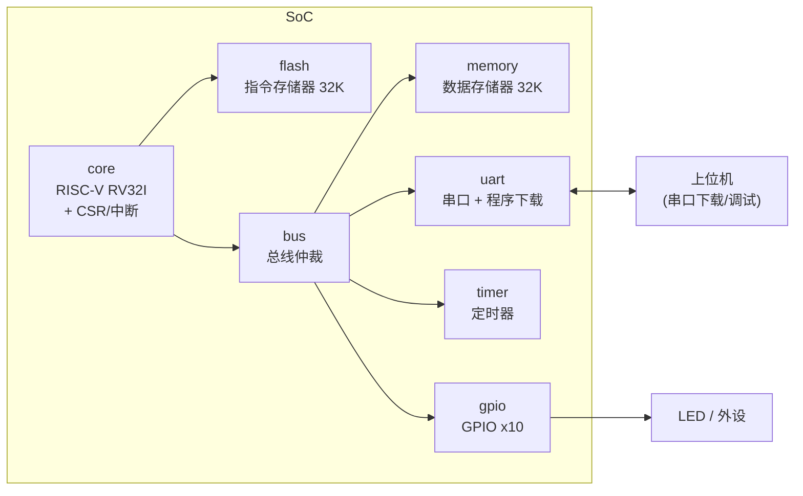

一个**简洁、可移植的 RISC-V SoC**：从零用 Verilog 实现了 RISC-V (RV32I) 处理器内核，并集成了 UART、定时器、GPIO 与中断控制器，支持**通过串口在线下载程序**，已在 Xilinx FPGA 上稳定运行。

> 📺 视频教程（FPGA 移植）：[easy riscv soc 移植到 FPGA](https://www.bilibili.com/video/BV1vY411j7mS)

---

## ✨ 特性

- **自研 RISC-V 处理器内核**：多周期、基于 phase 状态机，实现 RV32I 基础整数指令集
- **完整 CSR 与中断系统**：`mstatus / mie / mtvec / mepc / mcause / mip` 等寄存器，支持 `mret` 中断返回
- **片上外设**：UART（波特率可配）、定时器、10 位 GPIO，全部通过内存映射访问
- **串口在线下载程序**：通过自定义帧协议把编译产物写入片上 Flash，免去重复综合/烧录
- **完整软件工具链**：启动文件、链接脚本、中断处理、Makefile 一键编译
- **双平台验证**：支持 Icarus Verilog 仿真与 Vivado + Xilinx Zynq-7020 板级验证

---

## 🏗 系统架构



- 内核通过**自定义总线**与各外设互联，总线带仲裁器（`bus_authority`）支持多主设备访问
- 指令从 `flash` 读取；数据通路（读写内存、外设）统一走总线，简化了地址译码

---

## 📁 目录结构

```
easy_riscv_soc/
├── README.md
└── soc/
    ├── core.v               # RISC-V 内核（多周期，flash 取指）
    ├── core_comb.v          # 内核的另一版本（rom 取指，用于综合对比）
    ├── register.v           # 32×32 寄存器堆
    ├── alu.v                # 算术逻辑单元
    ├── csr_reg.v            # CSR 寄存器 + 中断控制
    ├── bus.v                # 总线仲裁器
    ├── memory.v             # 数据存储器（RAM，32K）
    ├── flash.v              # 指令存储器（Flash，32K，可串口写入）
    ├── uart.v               # UART（含串口下载协议）
    ├── timer.v              # 定时器
    ├── gpio.v               # GPIO
    ├── soc.v                # SoC 顶层
    ├── board.v              # FPGA 顶层（含时钟 IP）
    ├── tb_*.v               # 各类仿真测试平台
    └── compile/             # 软件工具链
        ├── Makefile         # 编译入口
        ├── common.mk        # 通用编译规则
        ├── link.lds         # 链接脚本
        ├── start.S          # 启动文件
        ├── interrupt.S      # 中断入口（寄存器保护/恢复）
        ├── interrupt.c/.h   # 中断处理与 CSR 宏
        ├── main.c           # 演示程序
        ├── code_conver.py   # 生成 initrom.txt / initrom.coe
        └── program.ipynb    # 串口下载脚本
```

---

## 📐 存储映射

| 外设/存储 | 基地址 | 说明 |
| --- | --- | --- |
| Flash（指令） | `0x0000_0000` | 32K，可经串口写入 |
| RAM（数据）  | `0x8000_0000` | 32K |
| Timer CSR    | `0x9000_0000` | bit0 使能 |
| Timer Count  | `0x9000_0001` | 计数比较值 |
| GPIO CSR     | `0xa000_0000` | 方向/控制 |
| GPIO Port    | `0xa000_0001` | 10 位输出端口 |
| UART CSR     | `0xb000_0000` | bit0=发送使能, bit1=接收使能, bit4=接收中断使能 |
| UART 波特率  | `0xb000_0001` | 计数器分频值 |
| UART 发送    | `0xb000_0002` | 发送数据 |
| UART 接收    | `0xb000_0003` | 接收数据 |

> 波特率计算：`count = f_clk / baudrate`。50 MHz 下 115200 对应 `433`，9600 对应 `5207`。

---

## 🧠 处理器内核

- **指令集**：RV32I 基础整数指令（算术/逻辑、移位、比较、访存、分支/跳转、CSR 访问、`mret`）
- **结构**：多周期、8 级 phase 状态机，寄存器堆 32×32 位，独立 ALU
- **中断**：`mtvec` 直接模式，平台中断号 **bit7 = 定时器**、**bit16 = UART 接收**
- **软件栈**：`start.S` 负责搬运 `.data`、清零 `.bss`、初始化栈；`interrupt.S` 完成 31 个寄存器的现场保护/恢复

---

## 📡 串口下载协议

固件通过 UART 以**帧**为单位写入 Flash，帧格式如下：

| 阶段 | 字节序列 |
| --- | --- |
| 起始帧 | `0x5A 0xA5 0x0F 0xF0` |
| 程序数据 | 4 字节对齐的指令流（大端序） |
| 结束帧 | `0xF0 0x0F 0xA5 0x5A` |

- 收到起始帧后 SoC 回发 `0x01`，开始接收程序；收到结束帧后回发 `0x02` 表示下载完成
- 可直接使用 `compile/program.ipynb`（Python + pyserial）完成一键下载

---

## 🚀 快速开始

### 1. 环境依赖

- **仿真**：Icarus Verilog（或 Vivado xsim）
- **综合/板级**：Vivado + Xilinx Zynq-7020 开发板
- **软件编译**：RISC-V GNU 工具链（`riscv-none-embed-gcc`，项目默认使用 gnu-mcu-eclipse 8.2.0）

### 2. 编译软件

```bash
cd soc/compile
# 修改 Makefile 中的 TOOLCHAIN_DIR 为你的工具链路径
make
```

编译产出 `main.bin`，再运行 `code_conver.py` 生成仿真用的 `initrom.txt` 与 Vivado 用的 `initrom.coe`：

```bash
python code_conver.py
```

### 3. 仿真

```bash
# 以 Icarus Verilog 为例
iverilog -o tb soc/*.v
vvp tb
gtkwave wave.vcd
```

测试平台会自动把 `initrom.txt` 加载进 Flash，验证内核取指、执行与外设行为。

### 4. FPGA 部署

1. 新建 Vivado 工程，添加 `soc/` 下全部 `.v` 源文件
2. 例化时钟 IP（50 MHz，`board.v` 中使用 `clk_wiz_0`）
3. 添加引脚约束（UART TX/RX、GPIO、时钟、复位）
4. 综合、实现并生成比特流，下载到开发板

### 5. 串口下载程序

用 `program.ipynb` 或任意串口工具，按上述帧协议发送 `main.bin`，即可在线更新 Flash 中的程序。

---

## 🧪 演示程序

`compile/main.c` 内置一个综合演示：

- **GPIO 流水灯**：GPIO 端口按 0→255 循环输出，驱动 LED
- **定时器中断**：每 1 秒触发一次定时器中断（50 MHz 下计数值 `50000000`）
- **UART 回显**：收到串口数据后原样回发，并支持接收中断

---

## ⚠️ 已知限制

- 内核实现 RV32I 基础指令集，`ecall / ebreak` 等环境调用类指令未实现
- 编译器默认 `-march=rv32im`，但硬件未实现乘除法（M）指令，编写程序时避免使用乘除指令或将 `-march` 改为 `rv32i`
- 中断为 `mtvec` 直接模式，所有中断共用同一入口

---

## 🙏 参考与致谢

本项目为学习 RISC-V 处理器与 SoC 设计的实践项目，参考了 [tinyriscv](https://github.com/liangkangnan/tinyriscv) 等开源项目，特此致谢。

## 📄 License

MIT
